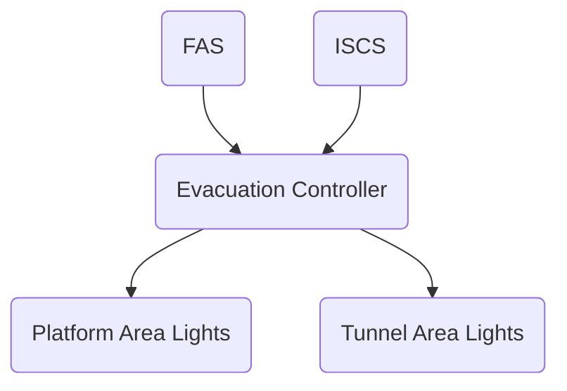

## 1.2 Architecture Diagram

```mermaid
flowchart TD
    A(FAS) --> B(Evacuation Controller)
    C(ISCS) --> B
    B --> D(Platform Area Lights)
    B --> E(Tunnel Area Lights)
``` 

This diagram reflects the proper connection flow: upstream systems (FAS and ISCS) → Evacuation Controller → execution devices (platform lights and tunnel lights).