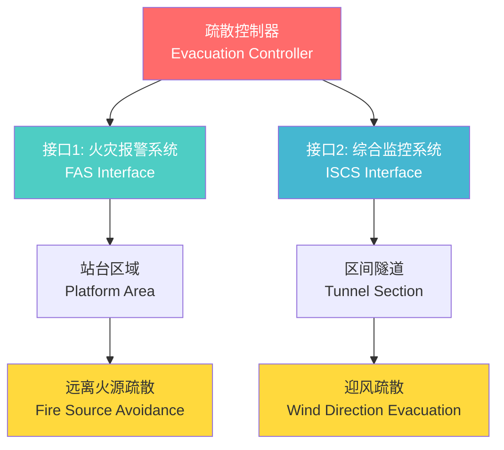
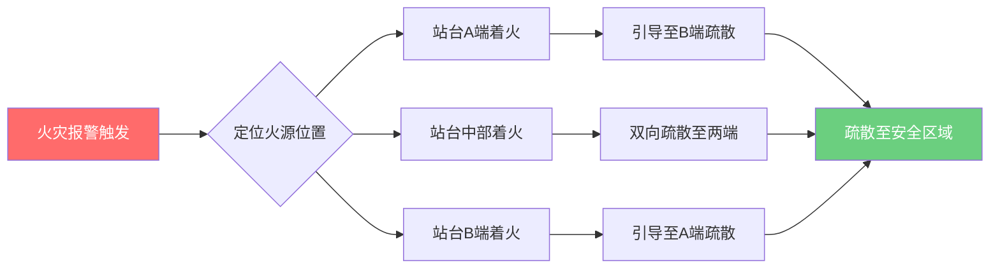
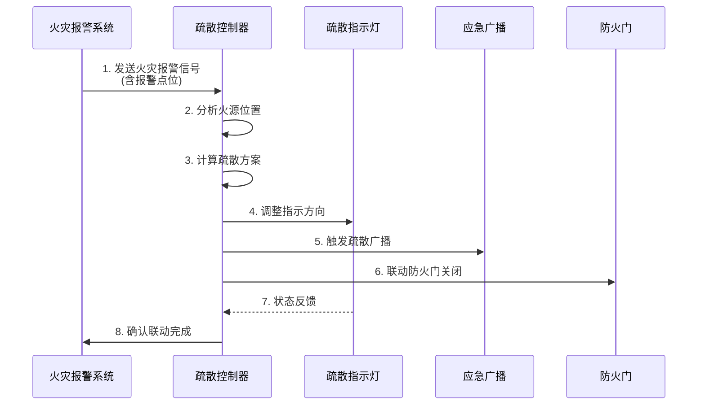
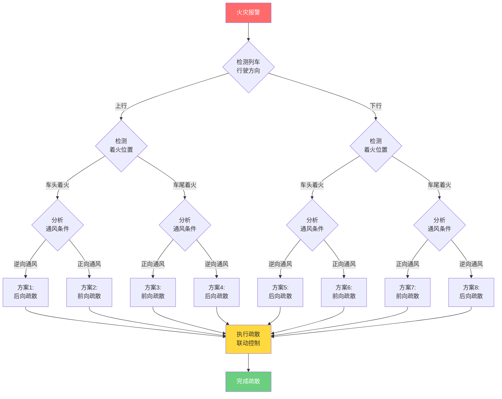
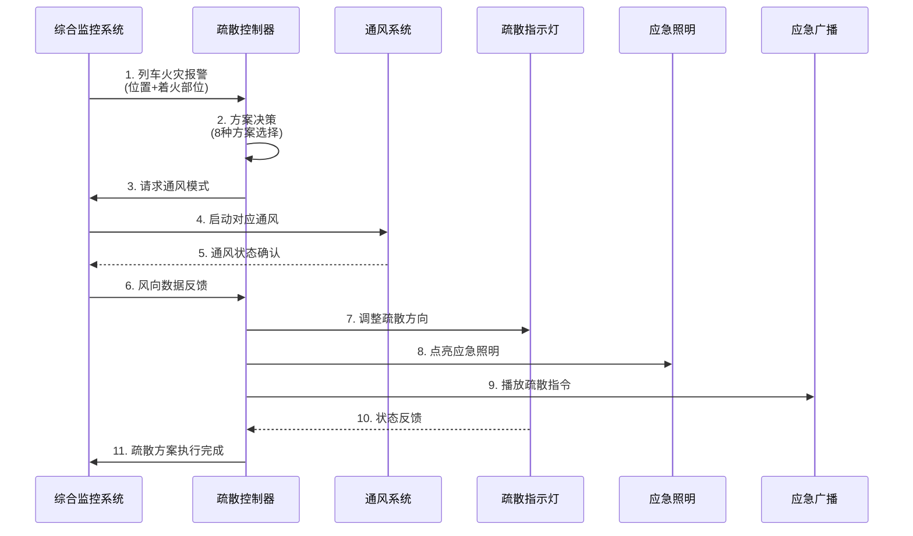
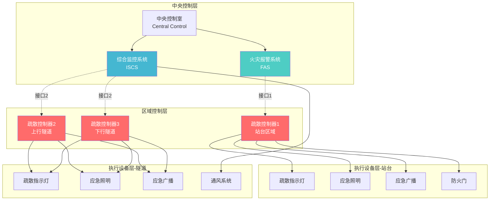
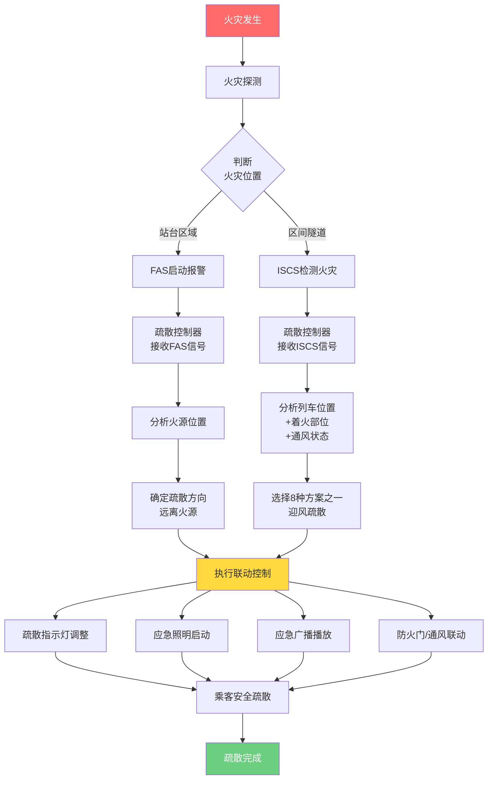

# 地铁应急疏散控制器联动系统技术文档

## 📋 目录

- [1. 系统概述](#1-系统概述)
- [2. 站台部分 - 火灾报警联动](#2-站台部分---火灾报警联动)
- [3. 区间隧道部分 - 综合监控联动](#3-区间隧道部分---综合监控联动)
- [4. 系统架构](#4-系统架构)
- [5. 应急响应流程](#5-应急响应流程)
- [6. 技术参数与规范](#6-技术参数与规范)

---

## 1. 系统概述

### 1.1 疏散控制器功能定位

疏散控制器是地铁应急疏散系统的核心控制设备，负责在火灾等紧急情况下，通过智能联动控制，引导乘客远离危险区域，实现安全、快速、有序的疏散。

### 1.2 双接口联动架构

疏散控制器采用**双接口联动**设计，根据不同应用场景与不同系统进行联动：

| 应用区域 | 联动系统 | 联动原则 | 疏散目标 |
|---------|---------|---------|---------|
| **站台部分** | 火灾报警系统（FAS） | 远离火源 | 安全疏散 |
| **区间隧道部分** | 综合监控系统（ISCS） | 迎风疏散 | 远离烟气 |



---

## 2. 站台部分 - 火灾报警联动

### 2.1 联动接口说明

- **联动对象**：火灾报警系统（Fire Alarm System, FAS）
- **接口协议**：标准消防联动协议（硬线/总线方式）
- **触发信号**：火灾报警点位信息

### 2.2 远离火源疏散原理

当站台区域发生火灾时，疏散控制器接收火灾报警系统的报警点位信息，自动识别火源位置，控制疏散指示标志调整指示方向，引导人员**背离火源方向**疏散。

#### 疏散策略



### 2.3 站台疏散场景示例

#### 场景一：站台A端着火

```
════════════════════════════════════════════════════════════
                    地铁站台平面图
────────────────────────────────────────────────────────────
  A端              站台中部              B端
[出入口]          [候车区域]          [出入口]
   ↑                                     ↑
   │                                     │
  🔥火源                               ✓ 安全
   ×                                     ○
  禁止                                  疏散
                                        方向
                  ➡️ ➡️ ➡️ ➡️ ➡️
                  疏散指示灯方向
════════════════════════════════════════════════════════════
```

**控制逻辑**：
1. FAS检测到A端火灾报警
2. 疏散控制器接收报警信号
3. 控制所有疏散指示灯指向B端
4. 应急广播播放疏散指令
5. 关闭A端出入口防火门

#### 场景二：站台中部着火

```
════════════════════════════════════════════════════════════
  A端              站台中部              B端
[出入口]          [候车区域]          [出入口]
   ↑                 🔥                  ↑
   ○                 ×                  ○
  安全              火源                安全
   
⬅️ ⬅️ ⬅️         禁止区域        ➡️ ➡️ ➡️
双向疏散                        双向疏散
════════════════════════════════════════════════════════════
```

**控制逻辑**：
1. 识别火源位于中部区域
2. A端侧疏散灯指向A端
3. B端侧疏散灯指向B端
4. 实施双向疏散策略

### 2.4 联动控制流程



---

## 3. 区间隧道部分 - 综合监控联动

### 3.1 联动接口说明

- **联动对象**：综合监控系统（Integrated Supervision & Control System, ISCS）
- **接口协议**：OPC/Modbus/以太网协议
- **联动信息**：
  - 列车位置信息
  - 着火车辆信息（车头/车尾）
  - 隧道通风状态
  - 风向风速数据

### 3.2 迎风疏散原则

**核心理念**：烟气随风向蔓延，疏散应**迎着风向**（逆风方向），**远离烟气**扩散方向。

```
风向示意图：
━━━━━━━━━━━━━━━━━━━━━━━━━━━━━━━━━━━━━━
        💨💨💨 风向 💨💨💨
  ←←←←←←←←←←←←←←←←←←←←←←←←←
        
  🚇 着火列车          
        ↓
      🔥火源
        ↓
      💨烟气随风扩散 ➡️➡️➡️
        
  ✓ 正确疏散方向：⬅️ 迎风（逆风）
  ✗ 错误疏散方向：➡️ 顺风（进入烟区）
━━━━━━━━━━━━━━━━━━━━━━━━━━━━━━━━━━━━━━
```

### 3.3 八种疏散方案详解

根据**列车行驶方向**（上行/下行）和**着火位置**（车头/车尾），共有**8种疏散方案**。

#### 方案分类矩阵

| 行驶方向 | 着火位置 | 方案编号 | 疏散策略 |
|---------|---------|---------|---------|
| 上行 | 车头着火 | 方案1 | 后向疏散至后方车站 |
| 上行 | 车头着火 | 方案2 | 前向疏散至前方车站 |
| 上行 | 车尾着火 | 方案3 | 前向疏散至前方车站 |
| 上行 | 车尾着火 | 方案4 | 后向疏散至后方车站 |
| 下行 | 车头着火 | 方案5 | 后向疏散至后方车站 |
| 下行 | 车头着火 | 方案6 | 前向疏散至前方车站 |
| 下行 | 车尾着火 | 方案7 | 前向疏散至前方车站 |
| 下行 | 车尾着火 | 方案8 | 后向疏散至后方车站 |

### 3.4 详细疏散方案图解

#### 上行区间疏散方案

##### 方案1：上行车头着火 + 逆向通风（后向疏散）

```
━━━━━━━━━━━━━━━━━━━━━━━━━━━━━━━━━━━━━━━━━━━━━━━━
后方车站 A                             前方车站 B
   🏢                                      🏢
    ╚═══════════════════════════════════════╝
              上行区间隧道
              
    💨💨💨 通风方向（向后） 💨💨💨
    ←←←←←←←←←←←←←←←←←←←←←←←←←
    
              🔥🚇════════
              车头        车尾
              着火
              
    ⬅️⬅️⬅️⬅️ 疏散方向 ⬅️⬅️⬅️⬅️
    （迎风，向后方车站A疏散）
    
    💨 烟气被吹向前方 ➡️➡️➡️
━━━━━━━━━━━━━━━━━━━━━━━━━━━━━━━━━━━━━━━━━━━━━━━━
```

**控制策略**：
- 隧道风机启动逆向通风
- 疏散指示灯全部指向后方车站A
- 应急照明全程点亮
- 乘客从车尾下车，沿隧道向后方车站疏散

---

##### 方案2：上行车头着火 + 正向通风（前向疏散）

```
━━━━━━━━━━━━━━━━━━━━━━━━━━━━━━━━━━━━━━━━━━━━━━━━
后方车站 A                             前方车站 B
   🏢                                      🏢
    ╚═══════════════════════════════════════╝
              
    💨💨💨 通风方向（向前） 💨💨💨
    ➡️➡️➡️➡️➡️➡️➡️➡️➡️➡️➡️➡️
    
              🔥🚇════════
              车头        车尾
              着火
              
              ➡️➡️➡️➡️ 疏散方向 ➡️➡️➡️➡️
              （迎风，向前方车站B疏散）
    
    ⬅️⬅️⬅️ 💨 烟气被吹向后方
━━━━━━━━━━━━━━━━━━━━━━━━━━━━━━━━━━━━━━━━━━━━━━━━
```

**控制策略**：
- 隧道风机启动正向通风
- 疏散指示灯全部指向前方车站B
- 乘客从车尾下车，沿隧道向前方车站疏散

---

##### 方案3：上行车尾着火 + 正向通风（前向疏散）

```
━━━━━━━━━━━━━━━━━━━━━━━━━━━━━━━━━━━━━━━━━━━━━━━━
后方车站 A                             前方车站 B
   🏢                                      🏢
    ╚═══════════════════════════════════════╝
              
    💨💨💨 通风方向（向前） 💨💨💨
    ➡️➡️➡️➡️➡️➡️➡️➡️➡️➡️➡️➡️
    
              ════════🚇🔥
              车头        车尾
                         着火
              
    ➡️➡️➡️➡️ 疏散方向 ➡️➡️➡️➡️
    （迎风，向前方车站B疏散）
              
              💨 烟气被吹向前方 ➡️➡️➡️
━━━━━━━━━━━━━━━━━━━━━━━━━━━━━━━━━━━━━━━━━━━━━━━━
```

**控制策略**：
- 正向通风
- 乘客从车头下车
- 向前方车站B疏散

---

##### 方案4：上行车尾着火 + 逆向通风（后向疏散）

```
━━━━━━━━━━━━━━━━━━━━━━━━━━━━━━━━━━━━━━━━━━━━━━━━
后方车站 A                             前方车站 B
   🏢                                      🏢
    ╚═══════════════════════════════════════╝
              
    💨💨💨 通风方向（向后） 💨💨💨
    ←←←←←←←←←←←←←←←←←←←←←←←←←
    
              ════════🚇🔥
              车头        车尾
                         着火
              
    ⬅️⬅️⬅️⬅️ 疏散方向 ⬅️⬅️⬅️⬅️
    （迎风，向后方车站A疏散）
    
    ⬅️⬅️⬅️ 💨 烟气被吹向后方
━━━━━━━━━━━━━━━━━━━━━━━━━━━━━━━━━━━━━━━━━━━━━━━━
```

**控制策略**：
- 逆向通风
- 乘客从车头下车
- 向后方车站A疏散

---

#### 下行区间疏散方案（方案5-8）

下行区间的疏散方案与上行类似，但列车行驶方向相反，具体方案根据**车头/车尾着火**和**通风方向**确定。

### 3.5 疏散方案决策流程



### 3.6 综合监控联动控制流程



---

## 4. 系统架构

### 4.1 整体联动架构图



### 4.2 信号流向图

```
┌─────────────────────────────────────────────────────────────┐
│                      火灾探测与判定                           │
└─────────────────────────────────────────────────────────────┘
                              │
                ┌─────────────┴─────────────┐
                │                           │
                ▼                           ▼
      ┌──────────────────┐        ┌──────────────────┐
      │  火灾报警系统     │        │  综合监控系统     │
      │      (FAS)       │        │     (ISCS)       │
      └──────────────────┘        └──────────────────┘
                │                           │
         硬线/总线信号              OPC/以太网协议
                │                           │
                ▼                           ▼
      ┌──────────────────┐        ┌──────────────────┐
      │  疏散控制器       │        │  疏散控制器       │
      │   (站台区域)      │        │   (隧道区域)      │
      └──────────────────┘        └──────────────────┘
                │                           │
    ┌───────────┼───────────┐   ┌───────────┼───────────┐
    ▼           ▼           ▼   ▼           ▼           ▼
 疏散灯    应急照明   应急广播  疏散灯   应急照明   通风系统
```

### 4.3 接口协议说明

#### 接口1：火灾报警系统接口

| 参数 | 说明 |
|-----|------|
| 接口类型 | 硬线输入/总线通讯 |
| 通讯协议 | GB16806标准协议 |
| 传输信息 | 报警点位地址、报警类型、设备状态 |
| 响应时间 | ≤3秒 |

#### 接口2：综合监控系统接口

| 参数 | 说明 |
|-----|------|
| 接口类型 | 以太网 |
| 通讯协议 | OPC UA / Modbus TCP |
| 传输信息 | 列车位置、着火位置、通风状态、环境参数 |
| 响应时间 | ≤5秒 |

---

## 5. 应急响应流程

### 5.1 总体响应流程



### 5.2 响应时间要求

| 阶段 | 时间要求 |
|-----|---------|
| 火灾探测 → 报警触发 | ≤30秒 |
| 报警触发 → 疏散控制器接收 | ≤3秒 |
| 方案决策 | ≤2秒 |
| 联动指令下发 | ≤3秒 |
| 疏散设备响应 | ≤5秒 |
| **总响应时间** | **≤43秒** |

---

## 6. 技术参数与规范

### 6.1 疏散控制器技术参数

| 参数项 | 技术指标 |
|-------|---------|
| 工作电压 | AC220V / DC24V（双电源） |
| 控制容量 | 单台≥256点 |
| 通讯接口 | RS485、以太网、硬线输入 |
| 响应时间 | ≤5秒 |
| 可靠性 | MTBF ≥50000小时 |
| 防护等级 | IP54 |
| 工作温度 | -10℃ ~ +55℃ |

### 6.2 执行设备参数

#### 疏散指示灯

| 参数 | 指标 |
|-----|------|
| 类型 | 智能可调向型 |
| 转向时间 | ≤1秒 |
| 应急时间 | ≥90分钟 |
| 安装间距 | ≤20米 |

#### 应急照明

| 参数 | 指标 |
|-----|------|
| 照度 | 地面≥5Lux |
| 应急时间 | ≥90分钟 |
| 启动时间 | ≤0.5秒 |

### 6.3 依据标准规范

- GB 51309-2018 《消防应急照明和疏散指示系统技术标准》
- GB 50157-2013 《地铁设计规范》
- GB 16806-2006 《消防联动控制系统》
- TB 10063-2016 《铁路工程设计防火规范》

---

## 7. 系统优势总结

### ✅ 双接口联动优势

1. **智能适应性**：根据不同场景自动选择最优疏散策略
2. **快速响应**：总响应时间≤43秒
3. **精准控制**：8种隧道疏散方案全覆盖
4. **安全可靠**：迎风疏散原则，远离烟气

### ✅ 核心技术特点

```
┌────────────────────────────────────────┐
│         疏散控制器核心能力              │
├────────────────────────────────────────┤
│ ✓ 双接口联动（FAS + ISCS）              │
│ ✓ 智能方案决策（站台 + 8种隧道方案）    │
│ ✓ 迎风疏散算法                          │
│ ✓ 远离火源策略                          │
│ ✓ 快速响应机制                          │
│ ✓ 多系统协同控制                        │
└────────────────────────────────────────┘
```

---

## 📞 技术支持

如有技术问题，请联系技术支持团队。

---

**文档版本**: v1.0  
**发布日期**: 2025-11-22  
**编制单位**: 地铁应急系统技术部