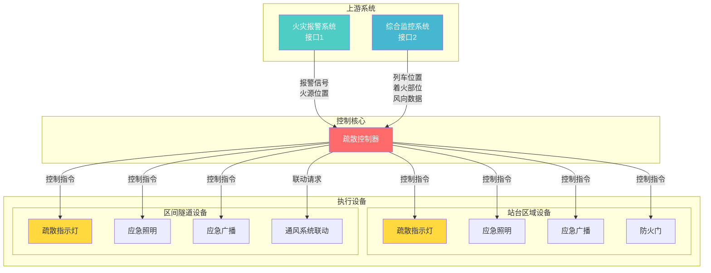

## 1.2 双接口联动架构

疏散控制器采用**双接口联动**设计，根据不同应用场景与不同系统进行联动：

| 应用区域 | 联动系统 | 联动原则 | 疏散目标 |
|---------|---------|---------|---------|
| **站台部分** | 火灾报警系统（FAS） | 远离火源 | 安全疏散 |
| **区间隧道部分** | 综合监控系统（ISCS） | 迎风疏散 | 远离烟气 |

**架构说明**：
- **接口1（FAS）**：接收火灾报警系统的报警信号，控制站台区域疏散设备
- **接口2（ISCS）**：接收综合监控系统的列车及环境信息，控制区间隧道疏散设备
- **疏散控制器**：作为核心控制单元，统一管理站台和隧道的所有疏散指示设备